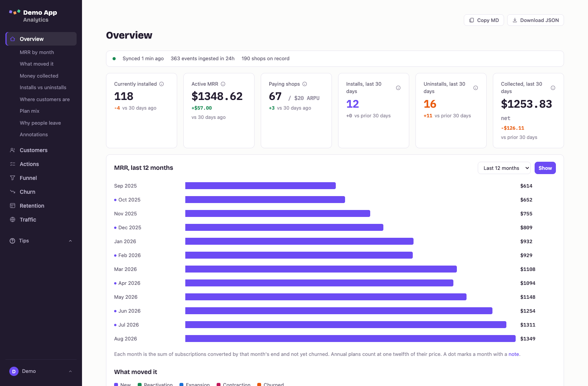
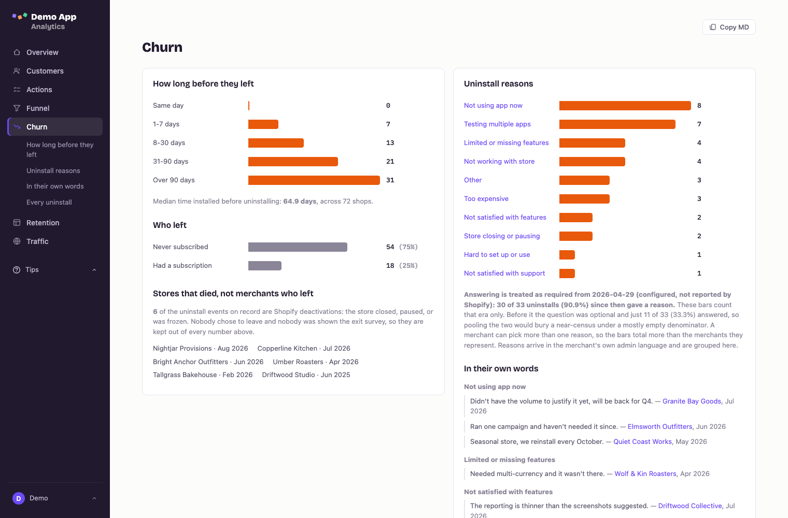
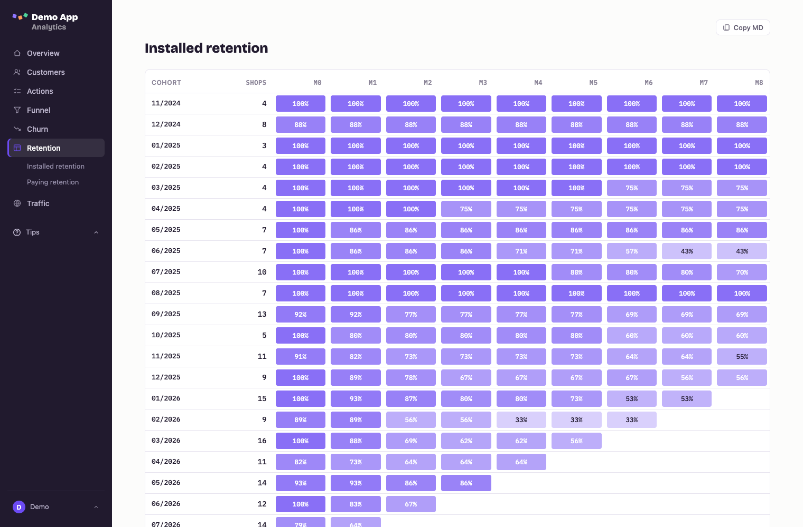
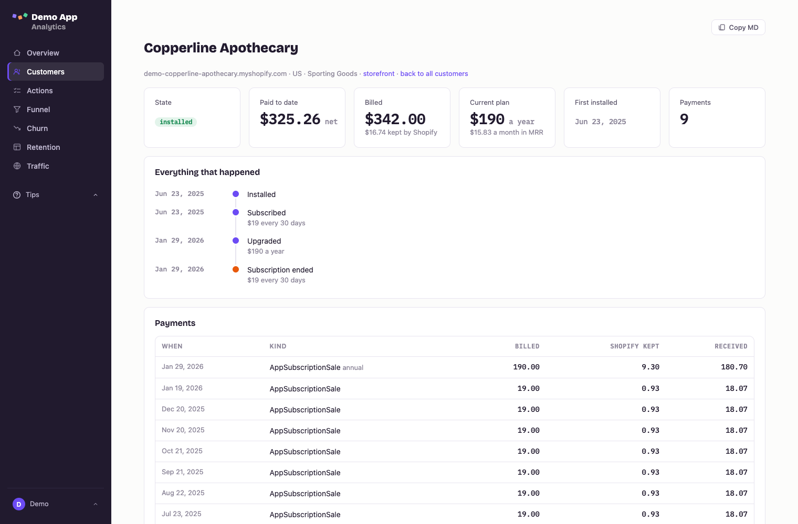
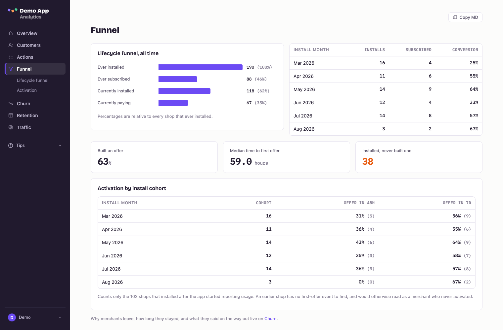
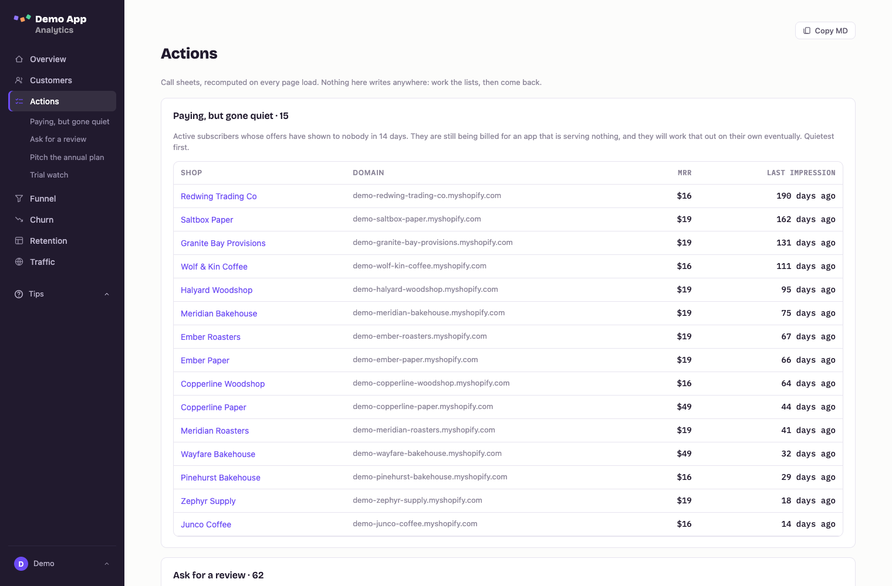
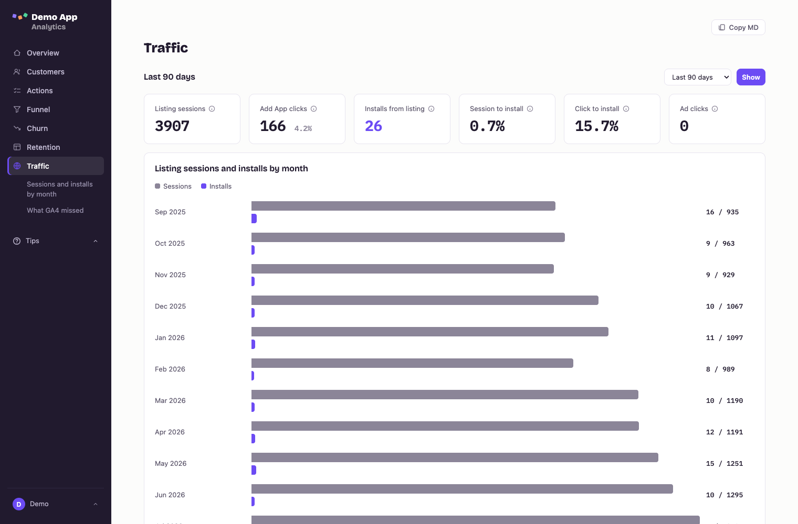
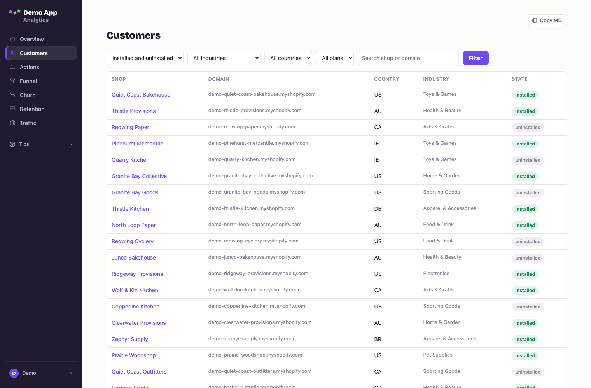
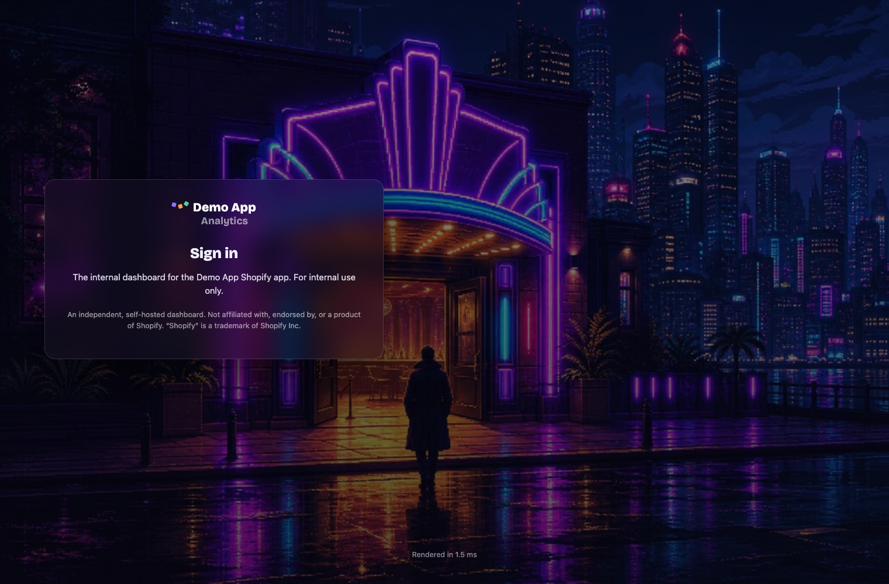

# Shopify App Dashboard

Self-hosted analytics for your own Shopify app. It polls the Shopify Partner API and derives
installs, uninstalls with reasons, MRR and what moved it, collected revenue, cohort retention,
churn, and activation.

[](https://github.com/kgelster/shopify-app-dashboard/actions/workflows/ci.yml)
[](LICENSE)
[](https://www.python.org/downloads/)

> ## Unofficial. Not a Shopify product.
>
> This is an independent project by an app developer, for app developers. It is **not affiliated
> with, endorsed by, sponsored by, or connected to Shopify Inc.** Nobody at Shopify has reviewed it.
> "Shopify" appears in the name only to say which API it reads, in the sense the law calls
> nominative use. Shopify, Shopify Partners and the Shopify App Store are trademarks of Shopify Inc.
>
> Everything below describing how the Partner API behaves is a field note from one app's traffic,
> not documentation and not a promise. Shopify can change any of it without telling either of us.



## It is in use on a real app

This is the dashboard behind [Promo Party](https://apps.shopify.com/promo-party-fgwp), a live app in
the Shopify App Store, and it is the one its developers actually open. One Fly machine, one
Postgres, polling the Partner API every 15 minutes, serving a real hostname since August 2026, when
[Mantle](https://docs.heymantle.com/wind-down) shut down and the replacement had to exist.

**The screenshots are not that app.** They come from `scripts/seed_demo.py`, which invents an app
called Demo App and about two hundred fictional merchants. No real merchant, domain, contact or
revenue figure appears anywhere in this repository, in the screenshots, or in the git history.

## What it gives you

- **Overview** with prior-period comparison on every tile, an MRR movements waterfall
  (new / expansion / contraction / churn), and an ops health strip.
- **Customers**, filterable and paginated, plus a per-merchant detail page with the full lifecycle
  timeline, payment history, and product usage.
- **Churn** with Shopify's uninstall reasons normalised across languages, and free-text verbatims.
- **Retention** by install and subscription cohort.
- **Funnel**, including activation if your app posts usage events.
- **Actions**: three call sheets (merchants worth asking for a review, monthly subscribers worth
  pitching the annual plan, recent installs that have not subscribed).
- **Traffic** from GA4: listing sessions, Add App clicks, installs, by channel, source and country.
- **A `.md` twin of every page** with a Copy button, and `/export.json` for the whole thing at once.
- **Slack** stale-sync alerts and a weekly digest.

## What it looks like

All synthetic, from `scripts/seed_demo.py`.

### Churn

Shopify serves the uninstall pick-list in the merchant's own admin language, so the same reason
arrives as "Testing multiple apps", "Testen mehrerer Apps" and "現在アプリを使用していない".
Grouping on the raw string gives you a long tail of one-off bars that says nothing. These are
bucketed, and the two things that would otherwise quietly corrupt the percentage are called out on
the page: stores Shopify closed (never shown the survey, so excluded) and the date the question
became mandatory (before and after are different questions, so they are not pooled).



### Retention

Install cohorts and subscription cohorts, separately. A merchant who keeps paying and a merchant who
keeps the app installed are different retention stories, and an app with a free tier can look
healthy on one while dying on the other.



### One merchant

The whole lifecycle in one place. This one shows the trap that costs the most money: Shopify does
not edit a subscription when a merchant changes plan, it activates a **new** `AppSubscription` and
cancels the old one, which is why the timeline reads "Upgraded" and "Subscription ended" on the same
day. It also shows an annual plan being normalised to `$15.83 a month in MRR`, and what Shopify
actually kept out of each charge, measured per transaction rather than assumed to be 2.9%.



### Funnel and activation

The Partner API knows lifecycle only: installed, paid, left. Whether anyone ever *used* the app is
invisible from that side, so activation is reported by the app itself through `POST /ingest/usage`.
Until events arrive it reads unknown, never 0%.



### Actions

Three call sheets, recomputed on every page load. Nothing here writes anywhere.



### Traffic

The one thing the Partner API exposes nothing about: App Store listing traffic. This reads it from
GA4 and reconciles listing installs against the installs in the events feed, which never quite
agree.



### Customers, and the sign-in page



Sign-in is Google OAuth restricted to an allowlist you configure, with HTTP Basic as the fallback
for whoever set it up. The allowlist is re-checked on every request, so removing an address locks
out the cookie it already issued.



## Requirements

Python 3.13, Postgres, and a Shopify Partner API token. Optionally a Google OAuth client for
sign-in, a GA4 property for listing traffic, and a Slack webhook.

## Quickstart, against your own app

```bash
uv sync
cp .env.example .env        # fill in real values, never commit this file
createdb app_dashboard
uv run python -m app_dashboard.migrate
uv run uvicorn app_dashboard.web:app --reload
```

Create the Partner API token at
`partners.shopify.com/<your-org-id>/settings/partner_api_clients` (note the slug is
`partner_api_clients`, not `api_clients`; the org id is the number in that URL).

The first sync replays your app's full history from the events feed, so there is no historical
import to arrange. It takes a few minutes on a long-lived app.

## Configuration

Everything is environment variables; `.env.example` is the complete list with notes. The ones that
are required and have no default are `DATABASE_URL`, `PARTNER_API_TOKEN`, `PARTNER_ORG_ID`,
`PARTNER_APP_ID`, `DASHBOARD_USERS`, `PUBLIC_BASE_URL`, and `GOOGLE_ALLOWED_DOMAINS`. The last two
have no default deliberately: a default there would point every deployment at whoever published it
and admit their staff.

Three settings decide whether the numbers are right, so they are worth reading twice:

| Var | Why it matters |
| --- | --- |
| `ANNUAL_PLAN_AMOUNTS` | `AppSubscription` carries no billing-interval field, so annual plans are recognised **by price**. List every annual price you charge, with cents. An unlisted annual price is treated as monthly and counted at **twelve times** its true MRR, with nothing on any page to say so. Empty (the default) means every plan is monthly; the app logs a warning at startup. Changing it later does not fix stored charges; see [forcing a full replay](#operating-it). |
| `USAGE_EVENT_TYPES` | The event names `POST /ingest/usage` accepts. Anything else is rejected rather than stored. The defaults use "offer" nouns; rename them to whatever your app does. |
| `TRUSTED_CLIENT_IP_HEADER` | The header your proxy puts the real client address in. Rate limiting keys on it, so leaving it wrong collapses every caller into one bucket. Prefer a single-value header your proxy *overwrites* (`Fly-Client-IP`, `CF-Connecting-IP`, `X-Real-IP`). `X-Forwarded-For` works, but proxies append to it, so only its rightmost entry is trustworthy, and that is the one read. Empty means trust the socket peer, correct only with nothing in front. |

`POLL_INTERVAL_MINUTES` also carries more weight than it looks: the ops-strip red threshold and the
stale-sync Slack alert are multiples of it (3 and 4 polls), so raising it moves them too.

## Deploy

There is a `Dockerfile` and a `fly.toml`. Nothing is Fly-specific in the application, but two
constraints are real wherever you run it:

- **One instance.** Two means two APScheduler instances, so duplicate polls and duplicate Slack
  alerts. `fly.toml` pins `min_machines_running`/`max` accordingly.
- **Run migrations on release.** `python -m app_dashboard.migrate` is idempotent and is wired as the
  `release_command`.

Set every secret before the first deploy. Required settings have no defaults, so a missing one is a
startup `ValidationError` rather than a subtly wrong dashboard, which is the intended trade.

## How it works

Read [`docs/architecture.md`](docs/architecture.md) before changing `derive.py` or `stats.py`. It
holds the pipeline map, the source-of-truth table, and the traps.

The short version: `raw_app_events` is an append-only mirror of the Partner API feed, `derive.py`
replays it into `shops` / `app_events` / `subscriptions`, and `stats.py` only ever reads. Derivation
is a **full replay, not an incremental apply**, so any change to derive logic rewrites history the
next time a shop is touched.

Per-number definitions live in `src/app_dashboard/metrics.py`, not in any document. The tiles and the `.md`
twins both read that registry. Add a metric there or its definition will not exist anywhere.
`src/app_dashboard/faq.py` is the same idea for the why-don't-these-match answers, rendered at `/faq`.

### Things the Partner API will get you wrong

These cost real debugging, all verified live against the 2026-07 API:

- **`shopifyFee` is not the fee.** It is Shopify's *revenue share*, which is 0% on the first $1M of
  lifetime revenue since 2025-01-01, so it reads `$0.00` on most rows. The billing processing fee
  appears *only* in the gap between `grossAmount` and `netAmount`. `gross - shopifyFee = net` is
  false. Every "what Shopify took" figure is `gross - net`.
- **That deduction is not a flat rate.** Identically priced charges settle at 2.895%, 4.895% and
  5.895% depending on the merchant. Read it per transaction; never calculate it.
- **`AppSubscription` has no billing interval.** Hence `ANNUAL_PLAN_AMOUNTS`. The one place the API
  states it outright is `AppSubscriptionSale.billingInterval` on a transaction, which
  `customer_detail` falls back to.
- **Shopify mints a new `AppSubscription` on a plan change** and cancels the old one
  (`subscribed → upgraded → unsubscribed`, both briefly live). Tracking a running total instead of
  per-subscription-id is wrong in both directions. It also does not guarantee a cancel event when a
  shop uninstalls, so derivation churns whatever is still live at that point.
- **`Transaction` is a GraphQL interface, not a union**, so `id` and `createdAt` are selectable on
  the node and only per-type fields need inline fragments.
- **Refunds arrive only as transactions**, never as app events. A dashboard reading only the events
  feed is blind to money coming back out.
- **`RELATIONSHIP_DEACTIVATED`** (store closed or frozen by Shopify) folds into type `uninstalled`.
  Those merchants are never shown the exit survey, so any "share who gave a reason" figure must
  exclude them or it understates coverage.
- **Uninstall reasons arrive localised** to the merchant's admin language.
  `src/app_dashboard/uninstall_reasons.py` maps the observed strings onto canonical buckets; unknown strings
  fall to "Unclassified" and are logged rather than vanishing into "Other".
- **The API 429s readily.** Paging is throttled to 0.3s per call.

### The uninstall-reason era boundary

Shopify made the exit question mandatory partway through 2026. Coverage either side is wildly
different, so pooling the two eras produces an average of two different questions that describes
neither. `REASON_MANDATORY_FROM` splits them. Read the right date off your own feed: it is the day
after your last uninstall with an empty reason.

## Markdown mirrors and the JSON export

Every page has a `.md` twin at the same path (`/index.md`, `/customers.md`, `/reports/churn.md`),
behind the same auth. YAML frontmatter, prose explaining what each number means, then the data as
fenced JSON. The Copy MD button puts the current page's twin on the clipboard, so a page can be
pasted into an agent as one prompt. Query params carry through:
`/customers.md?install_state=uninstalled` exports that filter.

Two rules hold in `markdown_export.py`, both tested: **no merchant contact details**, and **every
footnote caveat from the page is repeated in the prose** (a model that does not know deactivations
are folded into uninstalls will confidently report the wrong churn number).

`GET /export.json` is the whole dashboard as one file, and is deliberately not a twin:

- **Widest window, not the reader's window.** A twin honours `?days=`; this takes the lot.
- **No silent truncation.** Display defaults in `stats.py` are overridden by `export.LIMITS`, which
  is written into `meta.windows` so a reader can tell a real end from a ceiling.
- **Unknown is `null` with a `note`, never `0`.** An empty activation list would read as "nobody
  activated", which is a much better story than the truth.

## Backfilling country and industry

The Partner API does not expose merchant location or industry. If you are migrating off a vendor
that did, `import_shops_csv` fills those columns from a CSV, matched on myshopify domain:

```bash
python -m app_dashboard.import_shops_csv shops path/to/export.csv
```

Update-only: shop rows are created by derivation with a Partner shop GID primary key, so export rows
with no matching shop are logged and skipped. It never touches install state. Retitle `COLUMN_MAP`
to match your export's header.

It deliberately does not map contact columns. See `migrations/008_drop_bad_contacts.sql` for why:
those columns list every staff account on the shop, which on an app installed by agencies means
mostly agencies, and a column headed "who to write to" that names somebody else's agency is worse
than a blank.

## Operating it

**Forcing a full replay.** `sync_state.cursor` persists, so a normal poll only fetches events newer
than the cursor. Any change that widens the GraphQL query or corrects a stored value needs history
replayed, or the deploy will appear to do nothing:

```sql
update sync_state set cursor = null where source = 'partner_api';
```

Then restart the app; the scheduler syncs at boot. Safe and repeatable: `raw_app_events` dedupes on
its unique key, derivation is idempotent, and Slack does not re-alert because replayed events keep
their existing `app_events.id`.

**Marking a reviewer.** Nothing in the Partner API reports reviews, so `shops.reviewed_at` is
hand-maintained and the "Ask for a review" list is only as good as it is:

```sql
update shops set reviewed_at = '2026-01-15' where shop_domain = 'example.myshopify.com';
```

**Checking the data.** `scripts/check_invariants.py` runs 14 read-only invariants against any
`DATABASE_URL` and exits non-zero on failure, so it can gate a deploy:

```bash
DATABASE_URL=... uv run python scripts/check_invariants.py
```

The same invariants run in the test suite as `tests/test_invariants.py`.

## Usage events

The Partner API knows lifecycle only: installed, paid, left. It has no idea whether a merchant ever
configured anything, so "installed but never activated" is invisible from that side.
`POST /ingest/usage` closes that gap. Hand
[`docs/usage-events-integration.md`](docs/usage-events-integration.md) to whoever writes your app.

Until events arrive, activation reports read **unknown, not 0%**. A shop that installed before
tracking started has no activation event to find.

## Tests

```bash
createdb app_dashboard_test
uv run pytest
```

Tests need a real Postgres to run migrations against; `tests/conftest.py` sets everything else,
including a dummy required-settings block, so a fresh clone runs green. `DATABASE_URL` is the one
value it does not override. The `db` fixture truncates every table except `schema_migrations` before
each test, so the same database persists across runs.

## Layout

- `src/app_dashboard/web.py` : `create_app(conn_factory)`. `verify_creds` (Google session first, Basic auth
  second, both constant-time) gates every route except `GET /healthz`.
  **`/customers/{shop_domain}.md` is registered before the HTML route on purpose**: a path parameter
  compiles to a greedy `[^/]+`, so the other way round the `.md` URL is served as a shop literally
  named `x.myshopify.com.md`. Pinned by a test.
- `src/app_dashboard/partner_api.py` : the GraphQL client. `API_VERSION` is the version every query is
  written against.
- `src/app_dashboard/pipeline.py` / `derive.py` : ingest and replay.
- `src/app_dashboard/stats.py` : every read-side aggregate. `customers.py` is the Customers list and detail
  page, and deliberately never selects `owner_name` or `email`.
- `src/app_dashboard/metrics.py` / `faq.py` / `ranges.py` : the definition registry, the FAQ, and the
  allowlist behind every time-range control (shared by the pages and the twins, so a window one
  honours cannot be one the other ignores).
- `src/app_dashboard/security.py` : response headers, CSP, rate limiter. **Any new inline `<script>` in a
  template needs `nonce="{{ request.state.nonce }}"`** or the CSP blocks it silently.
- `src/app_dashboard/templates/` : Jinja2. `base.html` is the shell. Signed-out surfaces share `gate.html`,
  which empties the sidebar block, because a nav full of links you cannot follow is worse than none.
  `error.html` renders for 401/403/404 **only when the request accepts HTML**, so the `.md` twins and
  curl keep the JSON body; a rendered 401 keeps `WWW-Authenticate` or `curl -u` stops working.
  **Animation rule: animate the mark, never the container.** No element holding content may start at
  `opacity: 0`, and there is no `IntersectionObserver`. If the animation never runs the page must
  still look finished.
- `src/app_dashboard/migrations/` : plain numbered `.sql`, applied in filename order, tracked in
  `schema_migrations`.
- `scripts/check_invariants.py` : 14 read-only checks, exits non-zero, safe against production.
  `scripts/seed_demo.py` : the synthetic dataset in the screenshots. It goes through
  `upsert_raw_events` / `upsert_charges` / `upsert_transactions` and then `derive_installation`
  rather than writing derived rows itself, so it cannot produce a dashboard the real pipeline
  could not. It truncates every table it seeds and refuses to run without `--yes`.
- `docs/screenshots/` : the images in this README, all synthetic.

## Scope

This is what we run for our own app. It was built because Mantle shut down and the replacement
had to exist; publishing it costs nothing and it may save someone else the same build. It works; it
is not a product.

**No support is promised, and that is not modesty.** Issues and pull requests are welcome and may
sit for a while. Nobody is on call. There is no roadmap, no deprecation policy, and no reason to
expect a reply within any particular month. If you need something to depend on, fork it: MIT, and
the fork is yours.

What would actually help, in rough order: a new uninstall-reason string Shopify has started serving
(`src/app_dashboard/uninstall_reasons.py`, and unmapped ones are logged rather than hidden, so
`grep` your logs), a Partner API behaviour that contradicts something in this README, and a bug with
a failing test. See [CONTRIBUTING.md](CONTRIBUTING.md).

## License and trademarks

MIT. See [LICENSE](LICENSE).

Shopify, Shopify Partners, and the Shopify App Store are trademarks of Shopify Inc. This project is
not affiliated with, endorsed by, or sponsored by Shopify Inc., and the MIT licence covers this
code only, never anyone's trademarks. If you fork this and put a name on it, that name is your
problem to get right.
